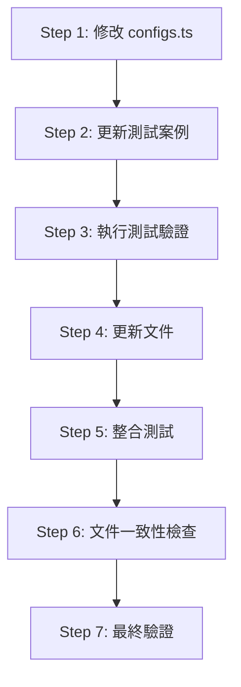

# 設計方案：增加 `pnpm-workspace.yaml` 到 `--monorepo` 移除清單

## 文件資訊

- **建立日期**: 2025-12-14
- **設計階段**: 詳細設計
- **相關 OpenSpec 變更**: `add-monorepo-flag`
- **狀態**: 待審核

---

## 1. 變更概述

### 1.1 背景

當前 `--monorepo` 功能已經移除 4 個與 monorepo 管理機制衝突的檔案：
- `pnpm-lock.yaml`
- `package-lock.json`
- `yarn.lock`
- `.npmrc`

然而，在使用 pnpm workspace 的 monorepo 環境中，`pnpm-workspace.yaml` 檔案同樣會造成巢狀 workspace 衝突。此檔案定義了 workspace 的套件路徑結構，在子專案中應由根目錄統一管理。

### 1.2 目標

在 `--monorepo` 功能中增加 `pnpm-workspace.yaml` 到移除清單，確保在 monorepo 環境中建立子專案時不會產生巢狀 workspace 問題。

### 1.3 影響範圍

- **程式碼**: 1 個設定檔案修改
- **測試**: 1 個測試檔案更新
- **文件**: 2 個文件更新（README + OpenSpec）
- **破壞性變更**: 無

---

## 2. 程式碼修改

### 2.1 主要修改清單

| 檔案路徑 | 修改類型 | 優先級 | 說明 |
|---------|---------|--------|------|
| [`src/configs.ts`](../../src/configs.ts:32) | 修改 | P0 | 新增 `pnpm-workspace.yaml` 到常數 |
| [`src/commands/createAction/createAction.monorepo.test.ts`](../../src/commands/createAction/createAction.monorepo.test.ts:1) | 修改 | P0 | 更新測試案例的檔案數量和斷言 |
| [`README.md`](../../README.md:60) | 修改 | P1 | 更新 monorepo 說明文件 |
| `openspec/changes/add-monorepo-flag/specs/project-creation/spec.md` | 修改 | P1 | 更新 OpenSpec 規格 |

### 2.2 詳細修改內容

#### 2.2.1 [`src/configs.ts`](../../src/configs.ts:32)

**當前程式碼** (第 28-37 行):
```typescript
/**
 * Monorepo 模式下需要移除的檔案清單
 * 這些檔案在 monorepo 環境中會與根目錄的套件管理機制衝突
 */
export const actionMonorepoFileNames = [
  'pnpm-lock.yaml',
  'package-lock.json',
  'yarn.lock',
  '.npmrc',
];
```

**修改後**:
```typescript
/**
 * Monorepo 模式下需要移除的檔案清單
 * 這些檔案在 monorepo 環境中會與根目錄的套件管理機制衝突
 */
export const actionMonorepoFileNames = [
  'pnpm-lock.yaml',
  'pnpm-workspace.yaml',
  'package-lock.json',
  'yarn.lock',
  '.npmrc',
];
```

**變更說明**:
- 在陣列第二位置插入 `'pnpm-workspace.yaml'`
- 保持檔案清單的邏輯分組：pnpm 相關檔案在前
- 陣列長度從 4 增加到 5

**影響評估**:
- ✅ 不影響現有邏輯，因為檔案清單是透過 [`getRmFlagRmList()`](../../src/commands/createAction/getRmFlagRmList.ts:3) 動態處理
- ✅ 向後相容，不破壞現有功能
- ⚠️ 需要同步更新測試斷言

---

## 3. 測試更新

### 3.1 受影響的測試檔案

#### 3.1.1 [`src/commands/createAction/createAction.monorepo.test.ts`](../../src/commands/createAction/createAction.monorepo.test.ts:1)

**需要修改的測試案例**:

##### Test Case 1: "should include monorepo files in remove list when --monorepo is true" (第 9-24 行)

**當前斷言**:
```typescript
expect(monorepoRmList).toHaveLength(4);
expect(monorepoRmList).toEqual([
  { field: 'pnpm-lock.yaml', isRemove: true },
  { field: 'package-lock.json', isRemove: true },
  { field: 'yarn.lock', isRemove: true },
  { field: '.npmrc', isRemove: true },
]);
```

**修改後**:
```typescript
expect(monorepoRmList).toHaveLength(5);
expect(monorepoRmList).toEqual([
  { field: 'pnpm-lock.yaml', isRemove: true },
  { field: 'pnpm-workspace.yaml', isRemove: true },
  { field: 'package-lock.json', isRemove: true },
  { field: 'yarn.lock', isRemove: true },
  { field: '.npmrc', isRemove: true },
]);
```

##### Test Case 2: "should contain all required monorepo files" (第 76-81 行)

**當前斷言**:
```typescript
expect(actionMonorepoFileNames).toContain('pnpm-lock.yaml');
expect(actionMonorepoFileNames).toContain('package-lock.json');
expect(actionMonorepoFileNames).toContain('yarn.lock');
expect(actionMonorepoFileNames).toContain('.npmrc');
```

**修改後**:
```typescript
expect(actionMonorepoFileNames).toContain('pnpm-lock.yaml');
expect(actionMonorepoFileNames).toContain('pnpm-workspace.yaml');
expect(actionMonorepoFileNames).toContain('package-lock.json');
expect(actionMonorepoFileNames).toContain('yarn.lock');
expect(actionMonorepoFileNames).toContain('.npmrc');
```

##### Test Case 3: "should have exactly 4 files" (第 83-85 行)

**當前斷言**:
```typescript
it('should have exactly 4 files', () => {
  expect(actionMonorepoFileNames).toHaveLength(4);
});
```

**修改後**:
```typescript
it('should have exactly 5 files', () => {
  expect(actionMonorepoFileNames).toHaveLength(5);
});
```

### 3.2 新增測試案例（可選）

建議新增以下測試案例以提升覆蓋率：

```typescript
describe('pnpm-workspace.yaml handling', () => {
  it('should include pnpm-workspace.yaml in monorepo file list', () => {
    expect(actionMonorepoFileNames).toContain('pnpm-workspace.yaml');
  });

  it('should place pnpm-workspace.yaml after pnpm-lock.yaml', () => {
    const pnpmLockIndex = actionMonorepoFileNames.indexOf('pnpm-lock.yaml');
    const pnpmWorkspaceIndex = actionMonorepoFileNames.indexOf('pnpm-workspace.yaml');
    
    expect(pnpmWorkspaceIndex).toBeGreaterThan(pnpmLockIndex);
    expect(pnpmWorkspaceIndex - pnpmLockIndex).toBe(1);
  });
});
```

### 3.3 測試執行計畫

```bash
# 1. 執行單元測試
npm run test src/commands/createAction/createAction.monorepo.test.ts

# 2. 執行完整測試套件
npm test

# 3. 檢查測試覆蓋率
npm run test:coverage
```

### 3.4 驗證檢查清單

- [ ] 所有現有測試通過
- [ ] 新的斷言正確反映 5 個檔案
- [ ] 測試覆蓋率不降低
- [ ] 無迴歸問題

---

## 4. 文件更新

### 4.1 README.md

#### 位置 1: Monorepo Mode 章節 (第 44-58 行)

**當前內容**:
```markdown
#### Monorepo Mode
```sh
# Non-interactive mode: Remove lock files, .npmrc, and packageManager field for monorepo subprojects
npx start-ts-by my-app -t user/repo --monorepo --ni
```

**修改後**:
```markdown
#### Monorepo Mode
```sh
# Non-interactive mode: Remove lock files, workspace config, .npmrc, and packageManager field
npx start-ts-by my-app -t user/repo --monorepo --ni
```

#### 位置 2: 檔案清單說明 (第 60-64 行)

**當前內容**:
```markdown
The `--monorepo` flag (or interactive prompt) automatically removes files that conflict with monorepo root configuration:
- `pnpm-lock.yaml`, `package-lock.json`, `yarn.lock` (lock files)
- `.npmrc` (package manager config)
- `packageManager` field in package.json
```

**修改後**:
```markdown
The `--monorepo` flag (or interactive prompt) automatically removes files that conflict with monorepo root configuration:
- `pnpm-lock.yaml`, `pnpm-workspace.yaml`, `package-lock.json`, `yarn.lock` (lock files and workspace config)
- `.npmrc` (package manager config)
- `packageManager` field in package.json
```

#### 位置 3: CLI Help 輸出 (第 185 行)

**當前內容**:
```
  --monorepo                        Remove monorepo conflicting files (lock files, .npmrc, packageManager field)
```

**修改後**:
```
  --monorepo                        Remove monorepo conflicting files (lock files, workspace config, .npmrc, packageManager field)
```

### 4.2 CLI Description 更新

在 [`src/commands/createAction/createAction.ts`](../../src/commands/createAction/createAction.ts:361) 中：

**當前內容** (第 361-364 行):
```typescript
{
  flags: '--monorepo',
  description:
    'Remove monorepo conflicting files (lock files, .npmrc, packageManager field)',
  defaultValue: false,
},
```

**修改後**:
```typescript
{
  flags: '--monorepo',
  description:
    'Remove monorepo conflicting files (lock files, workspace config, .npmrc, packageManager field)',
  defaultValue: false,
},
```

### 4.3 OpenSpec 規格更新

在 `openspec/changes/add-monorepo-flag/specs/project-creation/spec.md` 中：

#### 修改點 1: Requirement 說明 (第 6 行)

**當前內容**:
```markdown
系統應提供 `--monorepo` 旗標，讓使用者可以建立適合 monorepo 環境的子專案，自動移除與 monorepo 管理機制衝突的檔案和設定。
```

**修改後**:
```markdown
系統應提供 `--monorepo` 旗標，讓使用者可以建立適合 monorepo 環境的子專案，自動移除與 monorepo 管理機制衝突的檔案和設定，包括 pnpm workspace 設定檔。
```

#### 修改點 2: Scenario 檔案清單 (第 10-14 行)

**當前內容**:
```markdown
- **THEN** 系統應從生成的專案中移除以下檔案：
  - `pnpm-lock.yaml`
  - `package-lock.json`
  - `yarn.lock`
  - `.npmrc`
```

**修改後**:
```markdown
- **THEN** 系統應從生成的專案中移除以下檔案：
  - `pnpm-lock.yaml`
  - `pnpm-workspace.yaml`
  - `package-lock.json`
  - `yarn.lock`
  - `.npmrc`
```

#### 修改點 3: 新增場景測試

在 Requirement 章節末尾新增：

```markdown
#### Scenario: pnpm workspace 巢狀衝突預防
- **WHEN** 使用者在已有 pnpm workspace 的 monorepo 根目錄下使用 `--monorepo` 建立子專案
- **THEN** 系統應移除子專案的 `pnpm-workspace.yaml`
- **AND** 避免巢狀 workspace 設定衝突
- **AND** 子專案應正確被根目錄的 workspace 管理
```

### 4.4 Interactive Prompt 訊息更新

在 [`src/commands/createAction/createAction.ts`](../../src/commands/createAction/createAction.ts:289) 中：

**當前內容** (第 288-292 行):
```typescript
{
  key: 'monorepo',
  message:
    'Enable monorepo mode? (Remove lock files, .npmrc, and packageManager field)',
},
```

**修改後**:
```typescript
{
  key: 'monorepo',
  message:
    'Enable monorepo mode? (Remove lock files, workspace config, .npmrc, and packageManager field)',
},
```

---

## 5. 風險評估

### 5.1 潛在風險

| 風險項目 | 嚴重性 | 可能性 | 影響範圍 | 緩解措施 |
|---------|--------|--------|---------|---------|
| 檔案不存在時的處理 | 低 | 中 | 使用者體驗 | 現有邏輯已透過 [`checkExistPathAndRemove()`](../../src/utils/checkExistPathAndRemove.ts) 處理不存在的檔案 |
| 測試覆蓋率降低 | 低 | 低 | 程式碼品質 | 更新所有相關測試案例，確保斷言正確 |
| 使用者預期不符 | 低 | 低 | 使用者體驗 | 文件清楚說明會移除的檔案清單 |
| 向後相容性 | 無 | 無 | N/A | 純新增項目，不影響現有行為 |

### 5.2 邊界案例處理

#### Case 1: 模板不包含 pnpm-workspace.yaml
**情境**: 使用的模板本身不是 pnpm workspace 專案
**處理**: [`checkExistPathAndRemove()`](../../src/utils/checkExistPathAndRemove.ts) 已處理檔案不存在的情況，不會報錯
**驗證**: 現有測試已覆蓋此場景

#### Case 2: 檔案為唯讀
**情境**: `pnpm-workspace.yaml` 為唯讀檔案
**處理**: Node.js `fs.rmSync()` 會擲出錯誤
**建議**: 新增錯誤處理提示使用者檢查檔案權限（可選，非本次變更範圍）

#### Case 3: 符號連結
**情境**: `pnpm-workspace.yaml` 為符號連結
**處理**: `fs.rmSync()` 預設移除連結本身而非目標
**驗證**: 現有行為已滿足需求

### 5.3 相容性分析

#### 向後相容性
- ✅ **完全相容**: 僅新增清單項目，不修改邏輯
- ✅ **不影響現有使用者**: 未使用 `--monorepo` 的使用者無感知
- ✅ **可預測行為**: 符合使用者對 `--monorepo` 的預期

#### 前向相容性
- ✅ **可擴展**: 未來可繼續新增其他 monorepo 相關檔案
- ✅ **設計一致**: 遵循現有 `actionMonorepoFileNames` 模式

---

## 6. 實作步驟

### 6.1 實作順序（按依賴關係排序）



### 6.2 詳細步驟

#### Step 1: 修改核心設定檔 ⏱️ 2 分鐘
**檔案**: [`src/configs.ts`](../../src/configs.ts:32)

**操作**:
1. 找到 `actionMonorepoFileNames` 常數定義（第 32 行）
2. 在 `'pnpm-lock.yaml'` 之後插入 `'pnpm-workspace.yaml'`
3. 確認逗號和格式正確

**驗證**:
```bash
# 確認語法無誤
npm run typecheck
```

**預期結果**: TypeScript 編譯成功，無錯誤

---

#### Step 2: 更新測試案例 ⏱️ 5 分鐘
**檔案**: [`src/commands/createAction/createAction.monorepo.test.ts`](../../src/commands/createAction/createAction.monorepo.test.ts:1)

**操作**:
1. 修改第 17 行：`toHaveLength(4)` → `toHaveLength(5)`
2. 修改第 18-23 行：在陣列中插入 `{ field: 'pnpm-workspace.yaml', isRemove: true }`
3. 修改第 77-80 行：新增 `toContain('pnpm-workspace.yaml')`
4. 修改第 84 行：`toHaveLength(4)` → `toHaveLength(5)`

**驗證**:
```bash
# 執行特定測試檔案
npm run test src/commands/createAction/createAction.monorepo.test.ts
```

**預期結果**: 所有測試通過 ✅

---

#### Step 3: 執行測試驗證 ⏱️ 3 分鐘

**操作**:
```bash
# 1. 執行完整測試套件
npm test

# 2. 檢查測試覆蓋率
npm run test:coverage

# 3. 確認 linting
npm run lint
```

**通過標準**:
- [ ] 所有單元測試通過
- [ ] 測試覆蓋率維持 ≥ 原有百分比
- [ ] 無 lint 錯誤或警告

---

#### Step 4: 更新文件 ⏱️ 10 分鐘

**檔案清單**:
1. [`README.md`](../../README.md)
2. [`src/commands/createAction/createAction.ts`](../../src/commands/createAction/createAction.ts) (CLI description)
3. `openspec/changes/add-monorepo-flag/specs/project-creation/spec.md`

**操作**:
按照 **4. 文件更新** 章節的內容逐一修改

**驗證**:
```bash
# 檢查 CLI help 輸出
npx tsx src/index.ts create --help | grep monorepo

# 預期看到更新後的描述
```

**通過標準**:
- [ ] README.md 清單包含 `pnpm-workspace.yaml`
- [ ] CLI help 描述包含 "workspace config"
- [ ] OpenSpec 場景已更新

---

#### Step 5: 整合測試 ⏱️ 15 分鐘

**手動測試案例**:

##### Test 5.1: 非互動模式測試
```bash
# 1. 建立測試用模板（包含 pnpm-workspace.yaml）
mkdir -p /tmp/test-template
echo "packages:\n  - 'packages/*'" > /tmp/test-template/pnpm-workspace.yaml
echo '{"name":"test","version":"1.0.0"}' > /tmp/test-template/package.json

# 2. 測試 --monorepo 功能
npx tsx src/index.ts test-project -t file:/tmp/test-template --monorepo --ni

# 3. 驗證檔案被移除
cd test-project
ls -la | grep pnpm-workspace.yaml  # 應該找不到

# 4. 清理
cd .. && rm -rf test-project /tmp/test-template
```

**通過標準**: `pnpm-workspace.yaml` 不存在於生成的專案中

##### Test 5.2: 互動模式測試
```bash
# 執行互動模式（需手動回答提示）
npx tsx src/index.ts --monorepo

# 輸入：
# - Project name: test-interactive
# - Template: royfuwei/starter-ts-lib
# - Enable monorepo mode? y

# 驗證
cd test-interactive
ls -la | grep pnpm-workspace.yaml  # 應該找不到
```

##### Test 5.3: 與 --rm 組合測試
```bash
npx tsx src/index.ts test-combo -t file:/tmp/test-template --monorepo --rm README.md --ni

# 驗證兩組檔案都被移除
cd test-combo
ls -la | grep -E "pnpm-workspace.yaml|README.md"  # 都應該找不到
```

---

#### Step 6: 文件一致性檢查 ⏱️ 5 分鐘

**檢查項目**:

```bash
# 1. 執行實際 CLI help 並與 README 比對
npx tsx src/index.ts create --help > /tmp/actual-help.txt

# 2. 手動比對 README.md 的 CLI Help 章節
diff -u <(sed -n '/^## CLI Help/,/^##/p' README.md | grep monorepo) \
        <(grep monorepo /tmp/actual-help.txt)
```

**通過標準**:
- [ ] README.md 與實際 CLI help 一致
- [ ] 所有範例程式碼可執行
- [ ] 檔案清單在所有文件中一致

---

#### Step 7: 最終驗證 ⏱️ 5 分鐘

**驗證清單**:

```bash
# 1. 型別檢查
npm run typecheck

# 2. 完整測試套件
npm test

# 3. Linting
npm run lint

# 4. 建置檢查
npm run build

# 5. 手動冒煙測試
npx tsx src/index.ts smoke-test -t royfuwei/starter-ts-lib --monorepo --ni
cd smoke-test && npm install && npm test
```

**完成標準**:
- [ ] ✅ 所有自動化測試通過
- [ ] ✅ 建置成功
- [ ] ✅ 手動測試通過
- [ ] ✅ 無迴歸問題

---

### 6.3 時間估計

| 階段 | 預估時間 | 累積時間 |
|------|---------|---------|
| Step 1: 修改 configs.ts | 2 分鐘 | 2 分鐘 |
| Step 2: 更新測試案例 | 5 分鐘 | 7 分鐘 |
| Step 3: 執行測試驗證 | 3 分鐘 | 10 分鐘 |
| Step 4: 更新文件 | 10 分鐘 | 20 分鐘 |
| Step 5: 整合測試 | 15 分鐘 | 35 分鐘 |
| Step 6: 文件一致性檢查 | 5 分鐘 | 40 分鐘 |
| Step 7: 最終驗證 | 5 分鐘 | 45 分鐘 |
| **總計** | **45 分鐘** | - |

*註：時間為經驗開發者的估計，實際時間可能因環境而異*

---

### 6.4 回滾計畫

如果發現問題需要回滾：

```bash
# 1. 還原 configs.ts
git checkout src/configs.ts

# 2. 還原測試檔案
git checkout src/commands/createAction/createAction.monorepo.test.ts

# 3. 還原文件
git checkout README.md src/commands/createAction/createAction.ts

# 4. 重新執行測試確認
npm test
```

---

## 7. 驗證方法

### 7.1 自動化測試驗證

```bash
# 單元測試
npm run test src/commands/createAction/createAction.monorepo.test.ts

# 完整測試套件
npm test

# 測試覆蓋率
npm run test:coverage

# 預期結果：所有測試通過，覆蓋率不降低
```

### 7.2 手動功能驗證

#### 驗證場景 1: 基本功能
```bash
# 建立包含 pnpm-workspace.yaml 的測試模板
mkdir -p /tmp/pnpm-template
cat > /tmp/pnpm-template/pnpm-workspace.yaml << EOF
packages:
  - 'packages/*'
  - 'apps/*'
EOF
echo '{"name":"test","version":"1.0.0"}' > /tmp/pnpm-template/package.json

# 測試
npx start-ts-by test-project -t file:/tmp/pnpm-template --monorepo --ni

# 驗證
[ ! -f test-project/pnpm-workspace.yaml ] && echo "✅ PASS: pnpm-workspace.yaml removed" || echo "❌ FAIL"
```

#### 驗證場景 2: 檔案不存在時的優雅處理
```bash
# 建立不含 pnpm-workspace.yaml 的模板
mkdir -p /tmp/no-workspace-template
echo '{"name":"test","version":"1.0.0"}' > /tmp/no-workspace-template/package.json

# 測試（應正常完成，不報錯）
npx start-ts-by test-no-workspace -t file:/tmp/no-workspace-template --monorepo --ni

# 驗證專案建立成功
[ -d test-no-workspace ] && echo "✅ PASS: Project created without errors" || echo "❌ FAIL"
```

#### 驗證場景 3: 與其他參數組合
```bash
# 測試 --monorepo 與 --rm 組合
npx start-ts-by test-combo -t file:/tmp/pnpm-template --monorepo --rm .github --ni

# 驗證兩組檔案都被移除
[ ! -f test-combo/pnpm-workspace.yaml ] && [ ! -d test-combo/.github ] && \
  echo "✅ PASS: Both file lists applied" || echo "❌ FAIL"
```

### 7.3 文件驗證

```bash
# 1. CLI help 與 README 一致性
npx start-ts-by create --help | grep -A 1 monorepo

# 2. 確認輸出包含 "workspace config"
# 預期：--monorepo    Remove monorepo conflicting files (lock files, workspace config, .npmrc, packageManager field)

# 3. 驗證 README 範例可執行
# 手動執行 README.md 中的所有 --monorepo 範例
```

### 7.4 迴歸測試

```bash
# 確保不影響現有功能
npm test

# 確認非 --monorepo 模式不受影響
npx start-ts-by test-normal -t royfuwei/starter-ts-lib --ni
[ -f test-normal/pnpm-lock.yaml ] && echo "✅ PASS: Normal mode unaffected" || echo "❌ FAIL"
```

---

## 8. 檢查清單

### 8.1 實作前檢查

- [ ] 已閱讀完整設計文件
- [ ] 了解修改的影響範圍
- [ ] 確認開發環境正常（`npm install` 成功）
- [ ] 當前分支無未提交的變更
- [ ] 已執行並通過現有測試套件

### 8.2 實作中檢查

- [ ] 修改 [`src/configs.ts`](../../src/configs.ts:32) - 新增 `pnpm-workspace.yaml`
- [ ] 更新測試檔案 - 修改斷言從 4 改為 5
- [ ] 執行單元測試 - 全部通過
- [ ] 更新 [`README.md`](../../README.md) - 3 處修改
- [ ] 更新 CLI description - [`createAction.ts`](../../src/commands/createAction/createAction.ts)
- [ ] 更新 OpenSpec 規格 - `spec.md`

### 8.3 實作後檢查

- [ ] 所有自動化測試通過（`npm test`）
- [ ] TypeScript 編譯無誤（`npm run typecheck`）
- [ ] Linting 無錯誤（`npm run lint`）
- [ ] 測試覆蓋率維持或提升
- [ ] 手動功能測試通過（3 個場景）
- [ ] 文件一致性驗證通過
- [ ] CLI help 輸出正確
- [ ] 無迴歸問題

### 8.4 文件檢查

- [ ] README.md 範例可執行
- [ ] CLI help 與 README 一致
- [ ] OpenSpec 規格更新
- [ ] 程式碼註解清晰
- [ ] Commit message 符合規範

---

## 9. 附錄

### 9.1 相關檔案速查

| 檔案路徑 | 角色 | 關鍵內容 |
|---------|------|---------|
| [`src/configs.ts`](../../src/configs.ts:32) | 設定檔 | `actionMonorepoFileNames` 常數定義 |
| [`src/commands/createAction/getRmFlagRmList.ts`](../../src/commands/createAction/getRmFlagRmList.ts:3) | 工具函式 | 將檔案清單轉換為移除列表 |
| [`src/libs/createProject.ts`](../../src/libs/createProject.ts:12) | 核心邏輯 | 專案建立流程，呼叫 `checkExistPathAndRemove` |
| [`src/utils/checkExistPathAndRemove.ts`](../../src/utils/checkExistPathAndRemove.ts) | 工具函式 | 檢查並移除檔案，處理不存在的情況 |
| [`src/commands/createAction/createAction.monorepo.test.ts`](../../src/commands/createAction/createAction.monorepo.test.ts:1) | 測試檔案 | monorepo 功能的單元測試 |

### 9.2 程式碼流程圖

```mermaid
sequenceDiagram
    participant User
    participant CLI as createAction
    participant Config as configs.ts
    participant GetRm as getRmFlagRmList
    participant Create as createProject
    participant Check as checkExistPathAndRemove

    User->>CLI: --monorepo flag
    CLI->>Config: 讀取 actionMonorepoFileNames
    Config-->>CLI: ['pnpm-lock.yaml', 'pnpm-workspace.yaml', ...]
    CLI->>GetRm: 轉換為 RemoveFileInfoType[]
    GetRm-->>CLI: [{field: 'pnpm-lock.yaml', isRemove: true}, ...]
    CLI->>Create: createProject(params)
    loop 每個檔案
        Create->>Check: checkExistPathAndRemove(file)
        Check-->>Create: 移除成功或檔案不存在
    end
    Create-->>User: 專案建立完成
```

### 9.3 測試覆蓋矩陣

| 測試類型 | 測試案例 | 覆蓋檔案 | 狀態 |
|---------|---------|---------|------|
| 單元測試 | monorepo files count | `configs.ts` | 需更新 |
| 單元測試 | file list content | `configs.ts` | 需更新 |
| 單元測試 | remove list generation | `getRmFlagRmList.ts` | 自動通過 |
| 整合測試 | full flow with --monorepo | `createProject.ts` | 現有測試覆蓋 |
| E2E 測試 | real template processing | 完整流程 | 手動驗證 |

### 9.4 問題排查指南

#### 問題 1: 測試失敗 - Length mismatch
**症狀**: `expect(received).toHaveLength(expected)`  
         `Expected length: 5`  
         `Received length: 4`

**原因**: 忘記修改 `configs.ts` 或修改位置錯誤

**解決**:
```bash
# 1. 確認 configs.ts 修改
grep -A 5 "actionMonorepoFileNames" src/configs.ts

# 2. 應該看到 5 個檔案，包括 pnpm-workspace.yaml
```

#### 問題 2: CLI help 未更新
**症狀**: 執行 `--help` 看不到更新的描述

**原因**: 未修改 `createAction.ts` 的 description 欄位

**解決**:
```bash
# 確認描述已更新
grep -A 2 "flags: '--monorepo'" src/commands/createAction/createAction.ts

# 應該包含 "workspace config"
```

#### 問題 3: 檔案未被移除
**症狀**: 使用 `--monorepo` 後 `pnpm-workspace.yaml` 仍存在

**原因**: 可能是 `checkExistPathAndRemove` 邏輯問題

**除錯**:
```typescript
// 在 createProject.ts 中加入除錯訊息
console.log('removeList:', removeList);
// 確認清單包含 pnpm-workspace.yaml
```

### 9.5 參考資料

- [pnpm workspace 文件](https://pnpm.io/workspaces)
- [Monorepo 最佳實踐](https://monorepo.tools/)
- [Node.js fs.rmSync API](https://nodejs.org/api/fs.html#fsrmsyncpath-options)
- 專案內部文件：
  - [`openspec/AGENTS.md`](../../openspec/AGENTS.md)
  - [`openspec/changes/add-monorepo-flag/proposal.md`](../../openspec/changes/add-monorepo-flag/proposal.md)

---

## 10. 結論

### 10.1 變更摘要

本設計方案提供了在 `--monorepo` 功能中增加 `pnpm-workspace.yaml` 的完整實作指南。變更範圍小且明確：

- **1 個常數修改**: 在陣列中新增一個字串
- **3 個測試更新**: 修改數字和陣列斷言
- **4 個文件更新**: README、CLI description、OpenSpec、Interactive prompt

### 10.2 預期效益

- ✅ **解決實際問題**: 避免 pnpm workspace 巢狀衝突
- ✅ **使用者體驗改善**: 一個 flag 完整解決 monorepo 檔案衝突
- ✅ **維護性提升**: 集中管理 monorepo 相關檔案清單
- ✅ **零破壞性**: 完全向後相容

### 10.3 後續建議

1. **監控使用情況**: 觀察使用者是否遇到其他 monorepo 相關檔案衝突
2. **考慮擴展**: 未來可能需要支援的檔案：
   - `.yarnrc.yml` (Yarn 2+ workspace 設定)
   - `lerna.json` (Lerna monorepo 設定)
   - `rush.json` (Rush monorepo 設定)
3. **使用者教育**: 在部落格或文件中說明 monorepo 最佳實踐

### 10.4 批准建議

本設計方案建議：
- ✅ **批准實作**: 變更明確、風險低、效益高
- ⏱️ **實作時間**: 預計 45 分鐘完成
- 🎯 **優先級**: P1（高優先級，解決實際使用痛點）

---

**文件版本**: 1.0  
**最後更新**: 2025-12-14  
**設計者**: AI Architect Agent  
**審核狀態**: 待審核